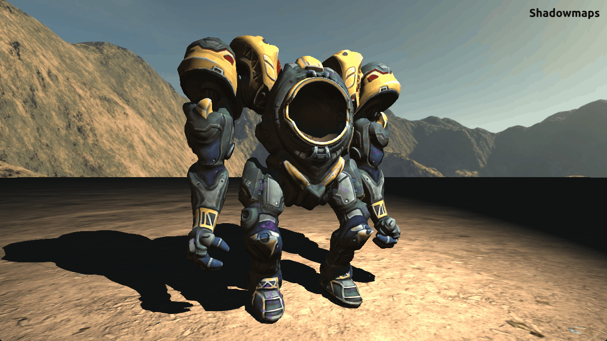
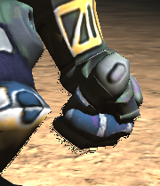
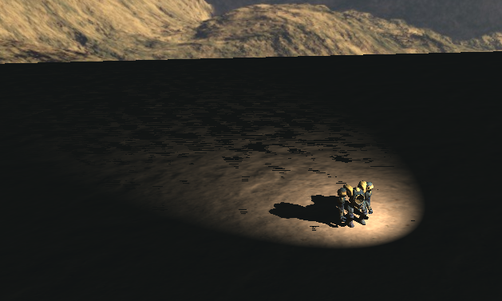

# Screen space shadows

Implementation of screen space shadows in OpenGL. Final project for the Computer Graphics unit of
the Bachelor's in Videogames at Universidade Lusófona.

**Screen space shadows** (also known as **contact shadows**) is a technique used to add extra shadow detail,
particularly around geometry that are very close to each other. It complements the more general
shadowmap technique.

For each light, a ray is marched (in view space) from the pixel to be drawn in the light's direction.
At each step, the ray's current position is compared to the value written on the depth buffer for that
position. If the ray's Z coordinate is greater (occluded from the camera), that pixel should be in shadow.
The render pipeline must include a pass for generating the depth buffer required by the algorithm.

This implementation was based on [Panos Karabelas' article about screen space shadows][SSSKarabelas].

## Demonstration

The following is a screenshot of a scene rendered with only shadowmaps. The model has been loaded
into the scene using the [AssimpNet] package.

After enabling screen space shadows, some additional sharp shadowed areas are noticeable.

In this GIF, the effect is easier to see.

## Limitations

An inherent limitation of screen space shadows is the lack of accuracy in determining pixel
occlusion, since there is a limited amount of samples along the ray and positions outside of the
bounds of the depth buffer cannot be sampled. As mentioned previously, the purpose of the technique
is to complement shadowmaps, not replace them.

Particularly, in this work, some artifacts are visible where the ground meets the edges of the mech
model.

Decreasing the thickness parameter (maximum depth delta considered by the algorithm) alleviates the
issue, but starts to introduce artifacts on geometry at a large distance from the camera.

To fix this, screen space shadows can be disabled when depth becomes greater than a certain
threshold. Since the shadows generated are very small scale, there isn't a significant loss in
overall scene quality.

## Usage

Clone and run.

Control the camera using the following keys:

| Key | Action       |
| --- | ------------ |
| W   | Move forward |
| A   | Move left    |
| S   | Move up      |
| D   | Move right   |
| Q   | Move down    |
| E   | Move up      |

Press `Shift + Esc` to quit the program.

## References

- [Inside Bend: Screen Space Shadows](https://www.bendstudio.com/blog/inside-bend-screen-space-shadows/)
- [Contact Shadows | Unreal Engine 4.27 Documentation](https://docs.unrealengine.com/4.27/en-US/BuildingWorlds/LightingAndShadows/ContactShadows/) 
- [ExileCon Dev Talk - Evolving Path of Exile's Renderer](https://www.youtube.com/watch?v=whyJzrVEgVc)
- [Screen space shadows][SSSKarabelas], a blog post by [Panos Karabelas](https://panoskarabelas.com/)
- Shader code adapted from Phong per-pixel lighting shader by [Diogo de Andrade][DAndrade]

## Licenses

[OpenTK], licensed under the [MIT] license.

[AssimpNet], under the [MIT] license.

Mech model: [Fishie | VGDC](https://sketchfab.com/3d-models/fishie-vgdc-6da1d9a980ee4608a2cc15af0649a583),
available under the [CC BY-NC 4.0] license.

Ground texture: [Dirt Floor (Poly Haven)](https://polyhaven.com/a/dirt_floor), licensed as [CC0].

Environment map: *arid2* from [skiingpenguins' Skybox Pack](https://opengameart.org/content/skiingpenguins-skybox-pack), licensed as [CC BY-SA 3.0].

Engine code developed by [Diogo de Andrade][DAndrade] and [Nuno Fachada][NFachada]; it is made
available under the [Mozilla Public License 2.0][MPLv2].

All the text and documentation (i.e., non-code files) are made available under
the [Creative Commons Attribution-NonCommercial-ShareAlike 4.0 International
License][CC BY-NC-SA 4.0].

[MPLv2]:https://opensource.org/licenses/MPL-2.0
[CC BY-NC 4.0]:http://creativecommons.org/licenses/by-nc/4.0/
[CC BY-SA 3.0]:https://creativecommons.org/licenses/by-sa/3.0/
[CC BY-NC-SA 4.0]:https://creativecommons.org/licenses/by-nc-sa/4.0/
[CC-BY3.0]:https://creativecommons.org/licenses/by/3.0/
[CC0]:https://creativecommons.org/publicdomain/zero/1.0/
[Ap2]:https://opensource.org/licenses/Apache-2.0
[OpenTK]:https://opentk.net/
[MIT]:https://opensource.org/license/mit/
[DAndrade]:https://github.com/DiogoDeAndrade
[NFachada]:https://github.com/fakenmc
[SSSKarabelas]:https://panoskarabelas.com/posts/screen_space_shadows/
[AssimpNet]:https://bitbucket.org/Starnick/assimpnet
